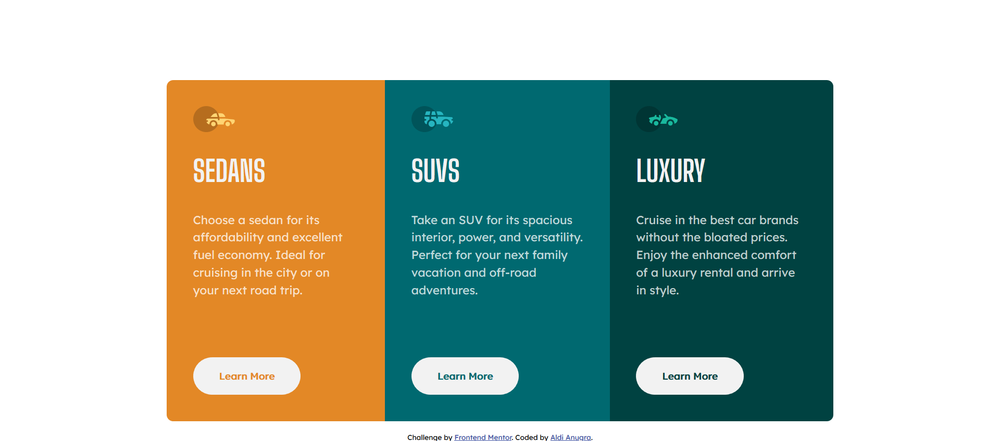

# Frontend Mentor - Stats preview card component solution

This is a solution to the [Stats preview card component challenge on Frontend Mentor](https://www.frontendmentor.io/challenges/stats-preview-card-component-8JqbgoU62). Frontend Mentor challenges help you improve your coding skills by building realistic projects.

## Table of contents

- [Overview](#overview)
  - [The challenge](#the-challenge)
  - [Screenshot](#screenshot)
  - [Links](#links)
- [My process](#my-process)
  - [Built with](#built-with)
  - [What I learned](#what-i-learned)
  - [Continued development](#continued-development)
  - [Useful resources](#useful-resources)
- [Author](#author)
- [Acknowledgments](#acknowledgments)

## Overview

### The challenge

Users should be able to:

- View the optimal layout depending on their device's screen size
- See hover states for interactive elements

### Screenshot




### Links

- Solution URL: [Final Solution](https://lnkd.in/gPwsGyR)
- Live Site URL: [Live Server](https://lordaldi.github.io/StatsPreviewCardComponent-FrontEndMentor/index.html)

## My process

### Built with

- Semantic HTML5 markup
- CSS custom properties
- Flexbox
- Mobile-first workflow

### What I learned

```css
.main-button {
  box-sizing: border-box;
  transition: all 0.25s;
  background-color: var(--neutral-color-2);
  border-radius: 50px;
  color: transparent;
  padding: 1.2em 2.5em;
  font-weight: bold;
  border: none;
  border: 3px solid rgba(0, 0, 0, 0);
  /* margin: 3px; */
}
.main-button:hover,
.main-button:active {
  margin: 0px;
  background-color: transparent;
  color: var(--neutral-color-2) !important;
  /* outline: 3px solid var(--neutral-color-1); */
  border: 3px solid var(--neutral-color-2);
}
```

### Continued development

In the future i want to learn to write css with sass

### Useful resources

- [flexbox malven](https://flexbox.malven.co/) - This is an amazing guide for referance when using flexboc. I'd recommend it to anyone still learning this concept.

## Author

- Website - [Aldi Anugra](https://github.com/LordAldi)
- Frontend Mentor - [@LordAldi](https://www.frontendmentor.io/profile/LordAldi)
- Instgram - [@aldi_anu](https://www.instagram.com/aldi_anu/)
- LinkedIn - [Aldi Anugra](https://www.linkedin.com/in/aldi-anugra-333132199/)
